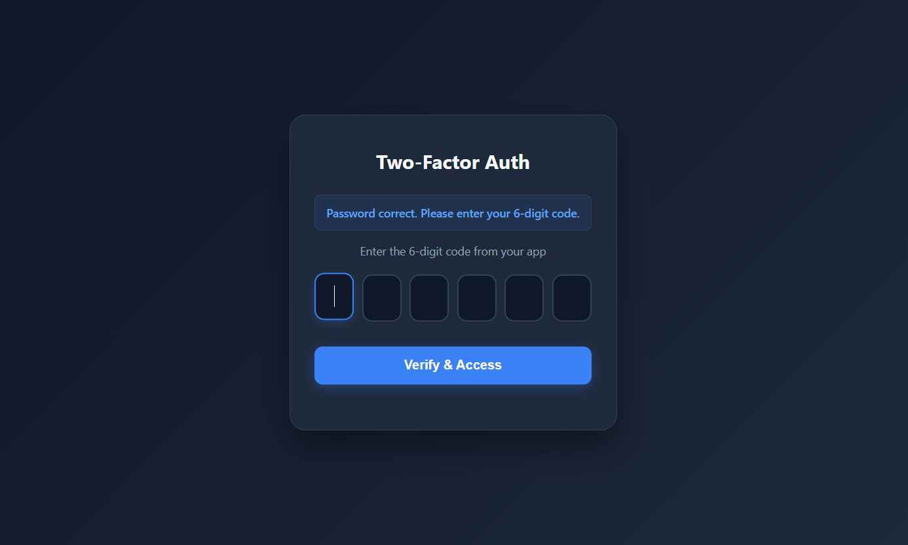

# Secure Authentication System

A complete, enterprise-grade secure authentication system built with Python and Flask.

## System Screenshots

### 1. User Registration


### 2. 2FA Setup (QR Code)


### 3. Login Process



### 4. Protected Dashboard & RBAC


## 🔥 Key Features
* **Advanced User Registration & Login:** Standard enrollment flow where the 2FA QR code is securely displayed only once during registration.
* **Password Hashing:** Passwords are encrypted and salted using **Bcrypt**.
* **Two-Factor Authentication (2FA):** Dynamic QR code generation using **PyOTP** with an interactive 6-digit OTP UI.
* **Secure Session Management:** Token-based authentication using **JWT**, securely stored in **HTTP-only Cookies** to prevent XSS attacks.
* **Strict Role-Based Access Control (RBAC):** URL-level protection ensuring users (Admin, Manager, User) can only access their authorized endpoints. 
* **Modular Architecture:** The system uses Flask Blueprints to separate routes based on privilege levels, ensuring scalable and maintainable code.
* **Modern UI:** A responsive, dark-mode user interface designed for a premium user experience.

## 📁 Project Structure
The application follows a modular structure for maximum security and maintainability:
- `app.py`: Main application entry point and Blueprint registration.
- `auth.py`: Handles registration, login, and 2FA verification logic.
- `admin_routes.py`: Restricted endpoints fetching full system data (Admin only).
- `manager_routes.py`: Restricted endpoints fetching partial data (Manager only).
- `user_routes.py`: Standard protected endpoints (Dashboard & Profile).
- `utils.py`: Contains security decorators (Token & Role verification) and UI templates.
- `models.py`: SQLAlchemy database schema definition.

## 🛠️ Tech Stack
* **Backend:** Python, Flask, Flask Blueprints
* **Database:** SQLite, SQLAlchemy
* **Security:** Bcrypt, PyOTP, PyJWT
* **Frontend:** HTML5, CSS3 (Modern Dark Theme), Vanilla JavaScript

## 🚀 How to Run
1. Install dependencies:
   ```bash
   pip install flask flask-sqlalchemy bcrypt pyotp pyjwt qrcode pillow

2. Run the server:
   python app.py

3. Open: http://127.0.0.1:5000/
