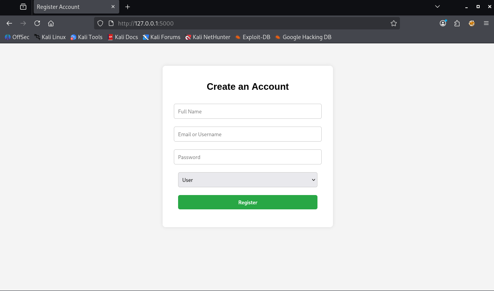
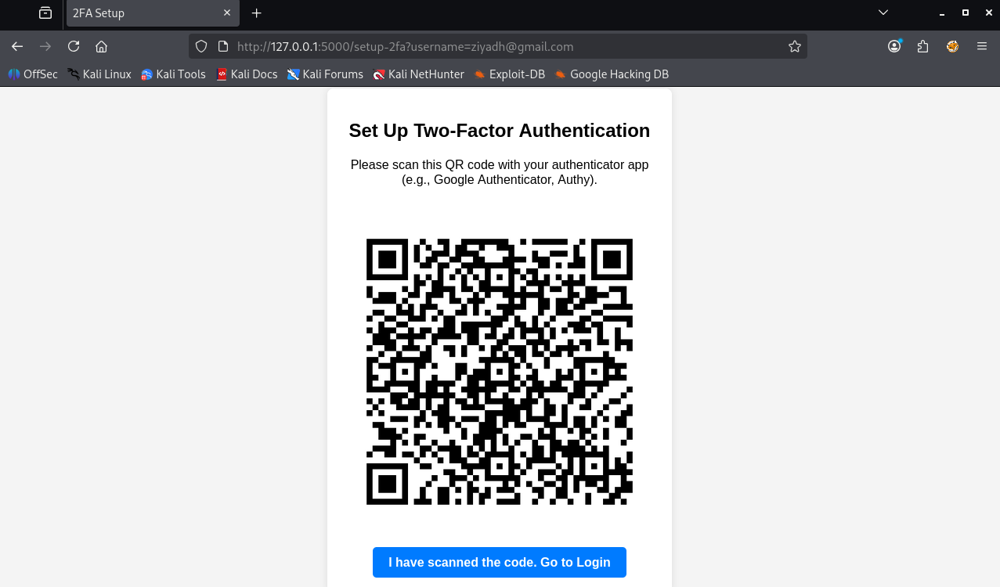
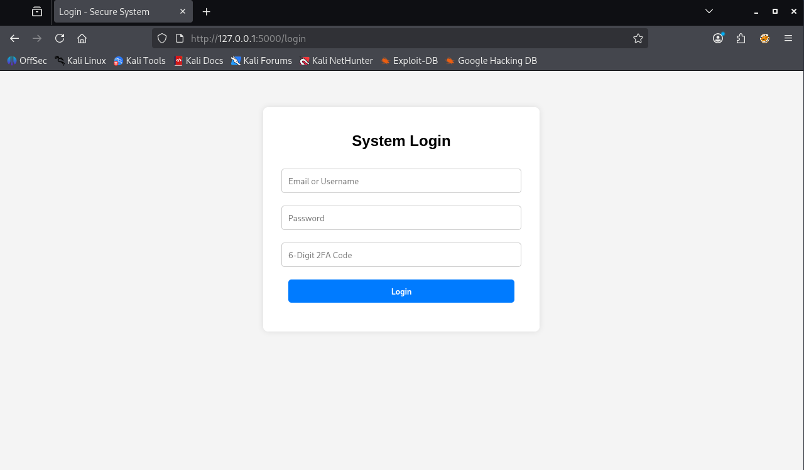
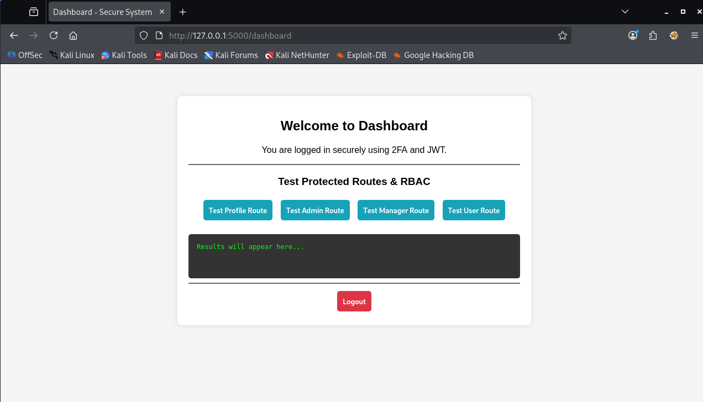

# Secure Authentication System

A complete, secure authentication system built with Python and Flask.

## System Screenshots

### 1. User Registration

### 2. 2FA Setup (QR Code)

### 3. Login Process

### 4. Protected Dashboard & RBAC

## Features
* **User Registration & Login:** Secure account creation.
* **Password Hashing:** Encrypted using bcrypt.
* **Two-Factor Authentication (2FA):** Dynamic QR code generation.
* **Token-Based Authentication:** JWT for secure sessions.
* **Role-Based Access Control (RBAC):** (Admin, Manager, User).

## Tech Stack
* **Backend:** Python, Flask
* **Database:** SQLite, SQLAlchemy
* **Security:** Bcrypt, PyOTP, PyJWT
* **Frontend:** HTML, CSS, JavaScript

## How to Run
1. Install dependencies:
   pip install flask flask-sqlalchemy bcrypt pyotp pyjwt qrcode pillow

2. Run the server:
   python app.py

3. Open: http://127.0.0.1:5000/
